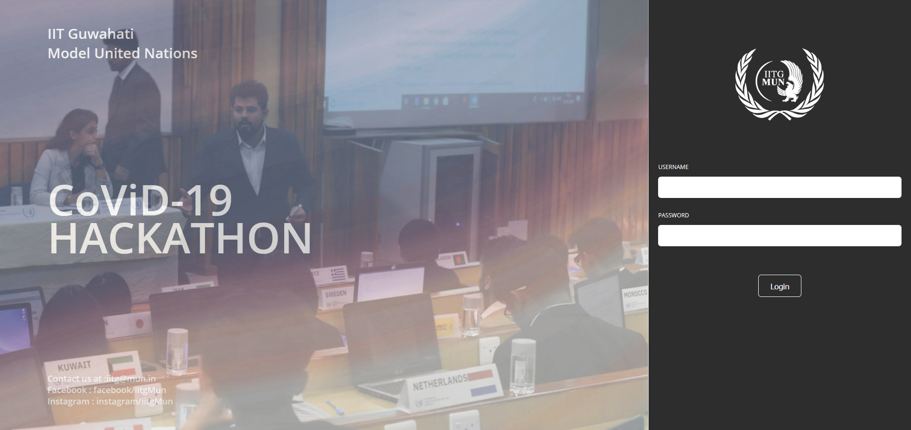
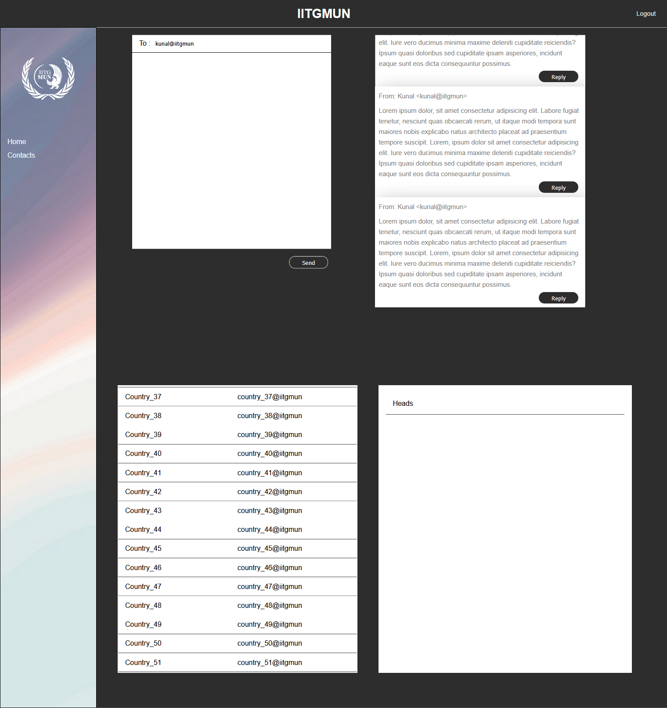
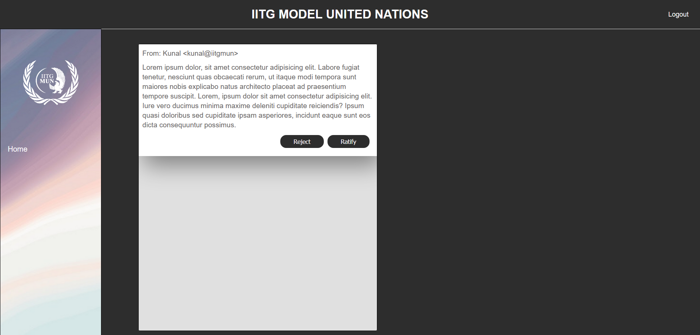

# DebateNation

 
 

IITG MUN COVID19 HACKATHON PLATFORM 
<i>Online debate panel</i>

# Pages

Login Page

  

Deligate Page

Judge/Moderator Page

# Working 
- Deligates participate in teams of 5
- Each deligate represent a country
 - Registered deligates can send a chit or reply to a chit by other deligates .
- The chit is then sent to moderator who can approve or disapprove it.
- Which is then forworded to judge to either ratify or reject
- if judge ratified the chit its sent back to deligates
And the debate goes on.

## TechStack
- Django
- Rest framework is used to fetch chits on deligate ,judge and moderator's side in regular interval
- Vanilla js(ajax)
